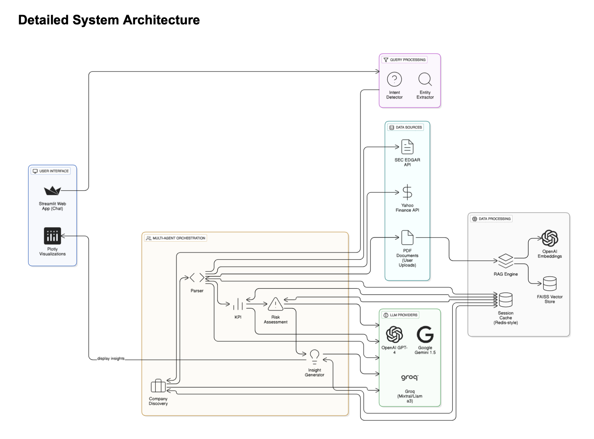

# FINSIGHT

# FinSight - Multi-Agent Financial Analysis Platform

FinSight is a sophisticated financial analysis platform that leverages multiple Large Language Models (LLMs) in a coordinated multi-agent architecture to provide real-time financial insights. The system processes natural language queries about publicly traded companies and delivers comprehensive analysis including investment recommendations, risk assessments, and financial metrics visualization.

## 🚀 Features

- **Natural Language Processing**: Ask questions about any publicly traded company in plain English
- **Multi-Agent Architecture**: Specialized AI agents for different financial analysis tasks
- **Real-Time Data Integration**: Live market data from Yahoo Finance and SEC EDGAR
- **Interactive Visualizations**: Rich charts for financial comparisons, risk scoring, and metric trends
- **Dual-Mode Analysis**: Beginner-friendly and professional-grade responses
- **Document Processing**: RAG-based analysis of financial documents (PDFs, 10-K, 10-Q filings)
- **Time-Aware Queries**: Intelligent parsing of time expressions like "past 5 years" or "Q3 2024"

## 🏗️ Architecture

FinSight uses a multi-agent system with five specialized agents:

1. **Company Discovery Agent**: Natural language entity extraction and company identification
2. **Parser Agent**: Financial data acquisition and structuring from APIs and documents
3. **KPI Agent**: Financial ratio and metric calculations (ROE, ROA, D/E, margins, etc.)
4. **Risk Assessment Agent**: Multi-factor risk analysis and scoring
5. **Insight Generator Agent**: Context-aware investment recommendations

### System Architecture

```
┌─────────────────┐    ┌──────────────────────────────────────┐    ┌─────────────────┐
│   User Query    │───▶│        LangGraph Workflow            │───▶│    Response     │
└─────────────────┘    │                                      │    └─────────────────┘
                       │  ┌─────────────────────────────────┐ │
                       │  │      Company Discovery Agent    │ │
                       │  │      Parser Agent               │ │
                       │  │      KPI Agent                  │ │
                       │  │      Risk Assessment Agent      │ │
                       │  │      Insight Generator Agent    │ │
                       │  └─────────────────────────────────┘ │
                       └──────────────────────────────────────┘
```
### Detailed System Architecture



## 🛠️ Technology Stack

### Frontend
- **Streamlit** 1.28+ - Interactive web interface
- **Plotly** - Interactive visualizations and charts
- **Session State Management** - User history and API caching

### Backend
- **LangGraph** - Multi-agent workflow orchestration
- **LangChain** - LLM integration and standardization
- **Python** 3.8+ - Core application logic

### LLM Providers
- **OpenAI GPT-4** - Insight generation and complex analysis
- **Google Gemini 1.5 Flash** - Company discovery and entity extraction
- **Groq (Mixtral, Llama3-70B)** - High-speed data processing and calculations

### Data Sources
- **Yahoo Finance API** - Real-time market data and company fundamentals
- **SEC EDGAR API** - Official filings and XBRL financial statements
- **OpenAI Embeddings + FAISS** - Document processing and semantic search

## 📊 LLM Performance Results

Based on comprehensive evaluation across 5 financial analysis tasks:

| Model | Overall Score | Avg Response Time | Best Use Cases |
|-------|---------------|-------------------|----------------|
| Gemini 1.5 Flash | 0.70 | 2.91s | Company discovery, Document parsing |
| Mixtral (Groq) | 0.68 | 1.60s | Risk assessment, Real-time responses |
| Llama 3 70B (Groq) | 0.64 | 1.45s | KPI extraction, Basic parsing |
| GPT-4 | 0.53 | 7.25s | Insight generation, Complex analysis |

## 🚦 Getting Started

### Prerequisites

- Python 3.8 or higher
- API keys for:
  - OpenAI
  - Google (Gemini)
  - Groq

### Installation

1. Clone the repository:
```bash
git clone https://github.com/your-username/finsight.git
cd finsight
```

2. Install dependencies:
```bash
pip install -r requirements.txt
```

3. Set up environment variables:
```bash
cp .env.example .env
# Edit .env with your API keys
```

4. Run the application:
```bash
streamlit run app.py
```

### Environment Variables

Create a `.env` file with the following variables:

```env
OPENAI_API_KEY=your_openai_api_key
GOOGLE_API_KEY=your_google_api_key
GROQ_API_KEY=your_groq_api_key
```

## 📖 Usage Examples

### Basic Queries
- "What is Apple's current P/E ratio?"
- "Analyze Microsoft's financial performance over the past 5 years"
- "Should I invest in Tesla? Give me a risk assessment"

### Advanced Queries
- "Compare Amazon's debt-to-equity ratio with the industry average"
- "What are the key risks for investing in Netflix right now?"
- "Analyze Google's quarterly earnings trends and provide investment insights"

### Document Analysis
- Upload a company's 10-K filing and ask: "What are the main risk factors mentioned in this document?"
- "Summarize the key financial highlights from this earnings report"

## 🔧 Configuration

### Model Selection Criteria

Each agent is optimized for specific tasks based on:

- **Performance & Latency**: Sub-second response times for discovery, <5s for analysis
- **Task-Specific Capabilities**: Specialized model selection for each agent type
- **Cost Efficiency**: 90%+ cost savings compared to using GPT-4 for all tasks
- **Output Quality**: Balanced approach between speed and accuracy

### Acceptable Latency Thresholds
- Company Discovery: <2 seconds
- Analysis Agents: <5 seconds
- Full Analysis Pipeline: <10 seconds

## 🎯 Key Features

### Time-Aware Query Processing
- Interprets natural language time expressions
- Handles fiscal vs. calendar year differences
- Accounts for typical 1-2 quarter reporting delays
- Intelligent fallback to most recent available data

### Document Processing (RAG)
- Supports PDF documents (10-K, 10-Q, earnings reports)
- 1000-character chunks with 200-character overlap
- Semantic search returns top 5 most relevant chunks
- Focus on relevant sections rather than entire documents

### Risk Assessment
- Quantitative risk scoring (Debt, Liquidity, Market risks)
- Qualitative factor analysis
- Multi-factor risk evaluation
- Risk level categorization and recommendations

## 🛡️ Error Handling

The system includes comprehensive error handling:
- Fallback responses for API failures
- User-friendly error messages
- Automatic retry mechanisms
- Graceful degradation when data is unavailable

## 📈 Performance Metrics

- **Company Identification Accuracy**: 80%+
- **Data Extraction Success Rate**: 95%+
- **Average Cost per Query**: $0.001-0.005 for discovery, $0.01-0.02 for full analysis
- **Response Time**: Sub-5 second end-to-end processing

## 🔮 Future Enhancements

### Planned Features
- Integration with Bloomberg and Reuters for premium data
- Redis implementation for distributed caching
- Technical analysis and sentiment tracking agents
- Enhanced agent collaboration using CrewAI
- Parallel agent execution for improved performance
- User feedback loops for output refinement

### Architecture Improvements
- Migration to CrewAI for enhanced agent collaboration
- Distributed caching with Redis
- Microservices architecture for better scalability
- Enhanced monitoring and logging capabilities

## 🤝 Contributing

We welcome contributions! Please see our [Contributing Guidelines](CONTRIBUTING.md) for details on how to submit pull requests, report issues, and contribute to the project.

## 📄 License

This project is licensed under the MIT License - see the [LICENSE](LICENSE) file for details.

## 🙏 Acknowledgments

- OpenAI for GPT-4 and embedding models
- Google for Gemini 1.5 Flash
- Groq for high-speed inference infrastructure
- Yahoo Finance and SEC EDGAR for financial data APIs
- The open-source community for the underlying frameworks

## 📞 Support

For support, please:
1. Check the [documentation](docs/)
2. Search existing [issues](https://github.com/your-username/finsight/issues)
3. Create a new issue if needed
4. Join our [Discord community](https://discord.gg/finsight)

---

**Disclaimer**: FinSight is designed for educational and research purposes. All financial analysis and investment recommendations should be verified with qualified financial professionals before making investment decisions.